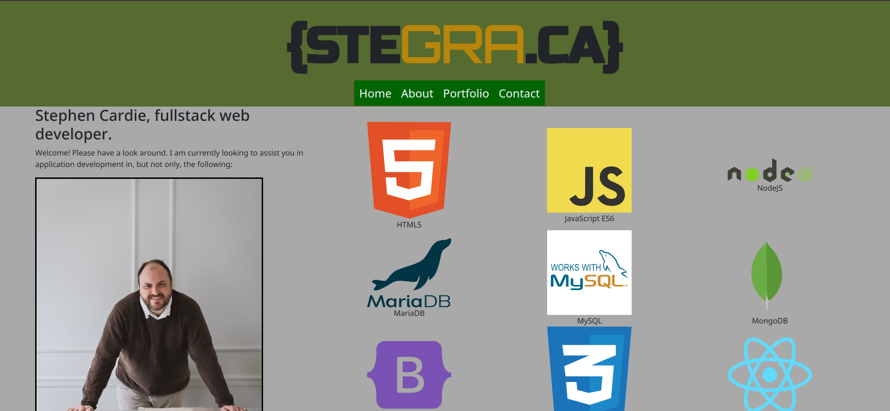

# stegraca-valise

## Task

This activity, the penultimate challenge, is to build a new portfolio in React. Luckily, I had recently purchased a domain to serve as my main page and self-hosted on my local server, so this was an excellent opportunity to do so!

I also call it the "Valise" as that is a classier word than "Portfolio."

For this task, I employed ReactJS, and React-Bootstrap along with regular JavaScript and CSS.

## Usage

- Access the page at https://omgthegreenranger.github.io/stegraca-valise
- Check out my beautiful picture.
- Enjoy my projects!

Here is a screenshot for you.

## Further information

Get the code at https://github.com/omgthegreenranger/stegraca-valise

I would also like to thank the Midnight Crew, as always, along with Geronimo Perez (my tutor) who gave me valuable insight into component folder structure and for state-based component switching.